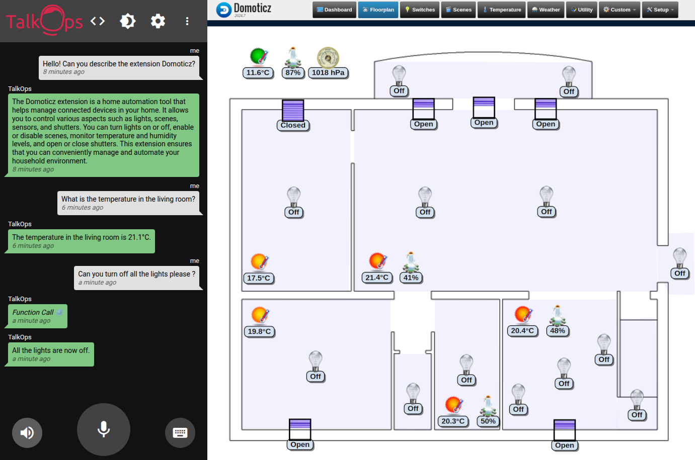

# TalkOps Extension: Domoticz


A TalkOps Extension made to work with [TalkOps](https://link.talkops.app/talkops).

This Extension based on [Domoticz](https://www.domoticz.com/) allows you to control connected devices by voice in **realtime**.



## Installation Guide

_[TalkOps](https://link.talkops.app/install-talkops) must be installed beforehand._

1. Enable the API in Domoticz: `Setup → Settings → Security`
2. Create a new user specifically for the TalkOps integration: `Setup → Users`
3. Grant this user access to the devices you want to control by voice: `Set Devices`
4. Set the environment variables using the credentials of the newly created user.

## Integration Guide

Add the service and setup the environment variables if needed:

_compose.yml_
``` yml
name: talkops

services:
...
  talkops-extension-domoticz:
    image: bierdok/talkops-extension-domoticz
    restart: unless-stopped
```

## Environment Variables

#### BASE_URL

The base URL of your Domoticz server.
* Default value: `http://domoticz:8080`

#### USERNAME

The username for authenticating with the Domoticz API.
* Default value: `admin`

#### PASSWORD

The password related to username.
* Default value: `domoticz`

#### AGENT_URLS

A comma-separated list of WebSocket server URLs for real-time communication with specified agents.
* Default value: `ws://talkops`
